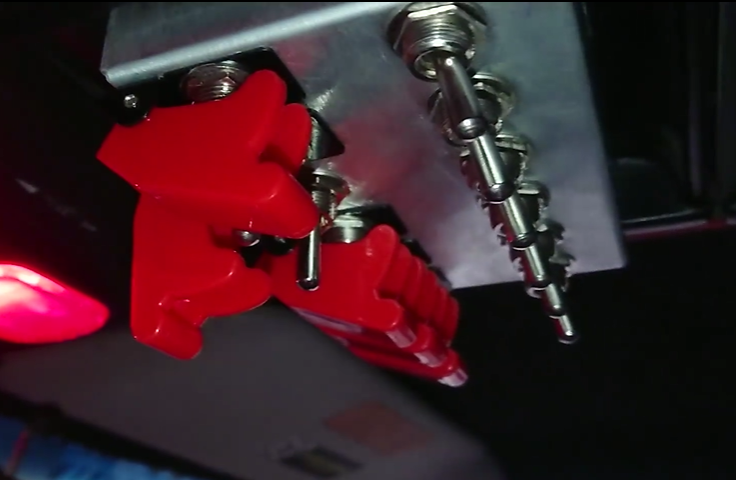

# Remote Switch Controller

This is a remote switch controller for vehicle accessories, similar to the SPOD and other brands. An Arduino is used on the receive
side as well as the transmit side. Up to 16 circuits are supported without needing to modify the code, and more can be added to use
with the arduino mega if needed.

Primarily intended for automotive use, this design can be used anywhere you need to remotely control relays or circuits via a switch
panel. The code in the transmitter and receiver are intended to be quite short and very robust. More code can lead to more bugs, so
the code was kept as concise as possible.

INSTALLATION DIFFICULTY: Slightly more difficult than wiring a switch/relay.

### Features
* Robust 9600-baud signal transmission using encoded characters for validation.
* Fail off mode in the event of a lost signal: circuits will power down automatically
* Extendable to add even more circuits!
* Only requires 3 wires passed through the firewall of the vehicle.
* Compatible with any standard open/closed switch.
* Error indication on receiver board.

## Needed supplies
* A 5v power supply (e.g. modified USB cable or step-down buck converter)
* 2 Arduino boards.
* Input switches or a switch gang panel.
* Multi-channel relay board or relays.
* A multi-circuit wire to connect the transmitter and receiver (CAT6 and RJ45 connectors recommended).
* A breakout board for your transmitter wire connections (RJ45 breakout recommended).
* A 10k (approx) pull-down resistor.
* Wires for all your connections.

# Assembly instructions
Included in this project is a [board diagram](board_diagram.brd) that can be used with TinkerCad to illustrate wire connections.

1. Connect your 5V power supply to the +5V and GND connectors on your receiver board and transmitter board.
2. Connect the TX pin on the transmitter to the RX pin on the receiver.
3. Connect Pin 12 to +5V on the receiver.
4. For each pin (A0, A1, A2, A3, A4, A5, 2, 3, 4, etc):
    1. Connect a switch between the +5V and transmitter pin.
    2. Connect your relay to the receiver pin.
5. Connect the 10k resistor between the +5V and GND circuit on the transmitter side (ultimately doesn't matter which side, but 
the transmitter is the one that needs it).

### Wiring Diagram:

Note that you will need to wire all the inputs and outputs, only 4 are illustrated here to make the diagram easier to read.

### Sample switch panel:

### Sample relay panel:

# Tweakables/configurable variables in the .ino

* `SIGNAL_PINS`: This variable controls the sequence of pins for input and output.
* `bailThreshold`: How many failed receives to wait for before fail mode starts.

# Some installation notes:

* The onboard LED/Pin 13 should be steadily on on the receiver, and off on the transmitter. If the LED is flashing,
your board is in receive mode and is not recieving a signal.
* The 10k pull-down resistor helps the switches avoid being in an "unknown" state in the event of a power loss or cable
breakage. This will keep your relays from flickering.
* Any form of open/closed switch can be used on the input side, everything from dip switches to large toggles will work!
* Multiple colors of wires are highly recommended for your switches to help keep them straight.
* Run your +5V from switch to switch instead of a separate wire from your distribution center. This will keep your wires
more organized (this is reflected in the provided diagram)
* The recommended RJ45/CAT6 cables are technically way more than you need for this project, but CAT6 is readily available 
and RJ45 connectors are easy to source and compact.
* If you need to re-flash your boards, be sure to connect the transmission cable before doing so. All other wires can be
left connected.

# Questions/details

### Why a wired signal?
Wired signals are more robust to transmission interference, and many off-road vehicles have two-way radios in them that can
interfere with transmission signals. Bluetooth can be error-prone and is difficult to troubleshoot and repair in the field.

### What about CANBUS?
Canbus was considered for this project, and may be implemented in the future. However, the standard UART serial transmission
was found to be robust enough for this use case.

### I have more questions or want to help!
Feel free to message me via Github for any contributions or questions.
